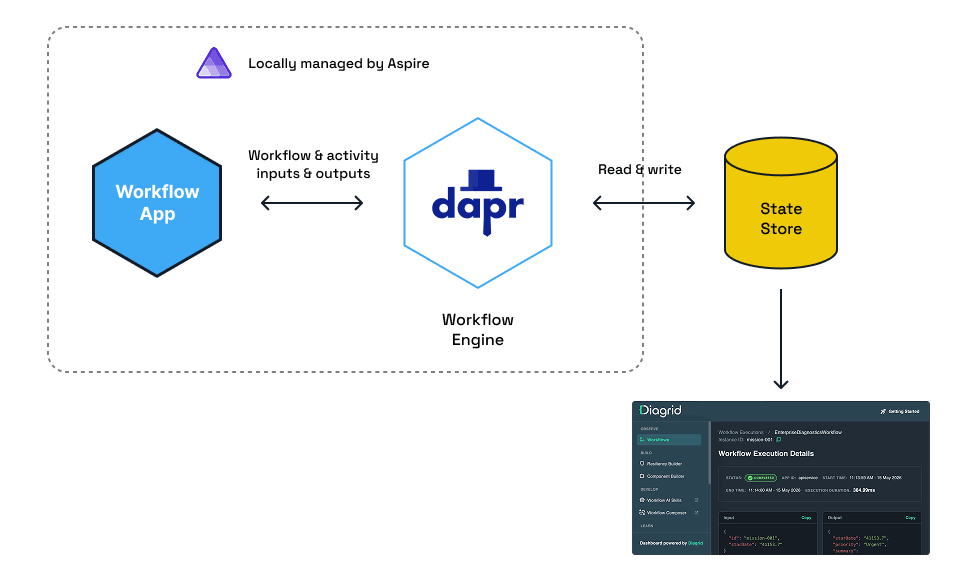
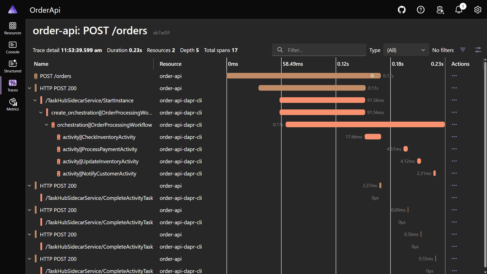
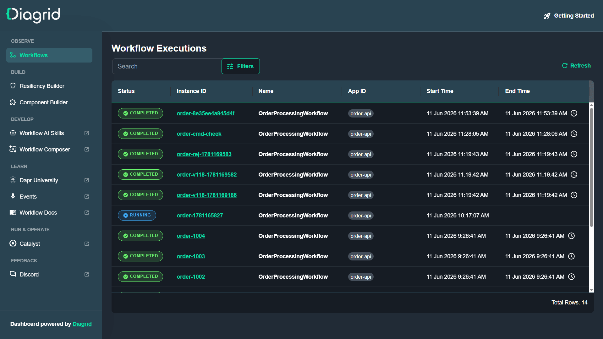
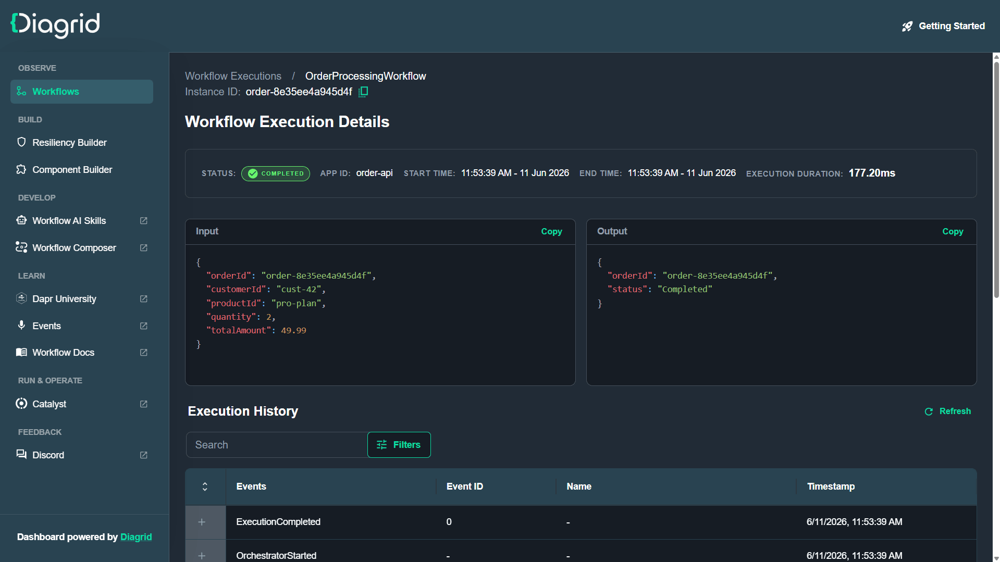
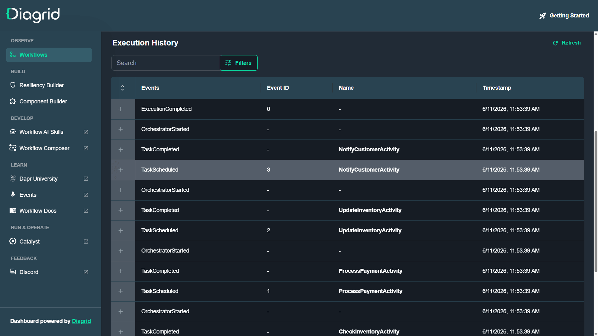

# Dapr Workflows with .NET Aspire

Source code for the newsletter issue [**Building Dapr Workflows in .NET With Aspire**](https://www.milanjovanovic.tech/blog/building-dapr-workflows-in-dotnet-with-aspire).

It's a small order-processing system that shows how to:

- Author a durable **Dapr Workflow** as plain C# code (task chaining pattern)
- Run the whole stack (API, Dapr sidecar, state store, dashboard) with a single `aspire run`
- Inspect workflow state locally with the **Diagrid Dev Dashboard**
- Cover the workflow with **Aspire integration tests**

## Architecture



_Diagram source: [Dapr University - Build Dapr Workflows in .NET with Aspire](https://www.diagrid.io/dapr-university/dapr-workflows-dotnet-aspire)_

The Aspire app host (`OrderApi.AppHost`) orchestrates four resources:

| Resource            | What it is                                                                             |
| ------------------- | -------------------------------------------------------------------------------------- |
| `order-api`         | ASP.NET Core API hosting the workflow, activities, and HTTP endpoints                  |
| `order-api` sidecar | Dapr sidecar running the workflow engine (via `CommunityToolkit.Aspire.Hosting.Dapr`)  |
| `statestore`        | Valkey (Redis fork) used as the workflow state store, pinned to port `16379`           |
| `diagrid-dashboard` | Diagrid Dev Dashboard container, reading the same state store                          |

Two Dapr component files live in `OrderApi.AppHost/Resources`:

- `statestore.yaml` - the workflow state store. The `actorStateStore: "true"` entry is required because Dapr Workflow runs on top of actors.
- `dashboard-store.yaml` - the same store as seen by the dashboard container. It connects through `host.docker.internal` (containers can't use the host's `localhost`) and is scoped to the `diagrid-dashboard` app ID so the API's sidecar ignores it.

## The workflow

`OrderProcessingWorkflow` chains four activities:

1. `CheckInventoryActivity` - checks stock for the ordered product (in-memory inventory, 100 units per product)
2. `ProcessPaymentActivity` - charges the customer (mock)
3. `UpdateInventoryActivity` - reserves the stock
4. `NotifyCustomerActivity` - sends the confirmation (mock)

If the product is out of stock, the workflow short-circuits and completes with `Rejected: out of stock`.
Every `CallActivityAsync` is a durable checkpoint: if the process dies mid-workflow, Dapr replays it from the recorded history and resumes where it left off.

The API exposes:

| Endpoint                   | Description                                        |
| -------------------------- | -------------------------------------------------- |
| `POST /orders`             | Starts a workflow instance, returns `202 Accepted` |
| `GET /orders/{instanceId}` | Returns the workflow's runtime status and output   |

## Prerequisites

- [.NET 10 SDK](https://dotnet.microsoft.com/download/dotnet/10.0)
- [Docker](https://www.docker.com/products/docker-desktop/) (running)
- [Aspire CLI](https://aspire.dev/)
- [Dapr CLI](https://docs.dapr.io/getting-started/install-dapr-cli/), initialized once with `dapr init`

## Running it

```bash
aspire run
```

Aspire starts Valkey, the Dapr sidecar, the API, and the Diagrid Dev Dashboard, and shows them all in the Aspire dashboard.

Grab the API's port from the Aspire dashboard and post an order:

```bash
curl -X POST http://localhost:<port>/orders \
  -H "Content-Type: application/json" \
  -d '{"orderId":"order-001","customerId":"cust-42","productId":"pro-plan","quantity":2,"totalAmount":49.99}'
```

> If the first request returns a `500`, give it a few seconds. The sidecar's workflow engine needs a moment to connect to the actor placement service after startup.

Then poll the status:

```bash
curl http://localhost:<port>/orders/order-001
```

```json
{
  "runtimeStatus": "Completed",
  "output": {
    "orderId": "order-001",
    "status": "Completed"
  }
}
```

To see the rejection path, order more than the available stock (100 units), e.g. `"quantity": 500`.

You can also trigger workflows straight from the Aspire dashboard.
The `order-api` resource has two custom commands: **Place test order** (completes successfully) and **Place out-of-stock order** (gets rejected).

Each activity shows up as a span in the distributed trace:



## Inspecting workflow state

Open the `diagrid-dashboard` endpoint from the Aspire resources view.
Every workflow instance is listed with its status, app ID, and duration:



Clicking an instance shows the exact input the workflow received and the output it produced:



The execution history shows every event: expand a `TaskScheduled` event to see an activity's input, or a `TaskCompleted` event to see its input and output:



## Tests

```bash
dotnet test
```

`OrderProcessing.Tests` uses [`Aspire.Hosting.Testing`](https://learn.microsoft.com/en-us/dotnet/aspire/testing/overview) to boot the full app host (containers, sidecar, and all) and verifies:

- A valid order completes with `Completed`
- An out-of-stock order completes with `Rejected: out of stock`
- An unknown instance ID returns `404`
- The Diagrid Dev Dashboard is reachable

One detail worth knowing: the test fixture passes `DcpPublisher:RandomizePorts=false`, because the Dapr component files point at the fixed Valkey port (`16379`) and Aspire's testing builder randomizes ports by default.

## Learn more

- [Building Dapr Workflows in .NET With Aspire](https://www.milanjovanovic.tech/blog/building-dapr-workflows-in-dotnet-with-aspire) - the full article
- [Build Dapr Workflows in .NET with Aspire](https://www.diagrid.io/dapr-university/dapr-workflows-dotnet-aspire) - free hands-on Dapr University track
- [Diagrid Dev Dashboard docs](https://docs.diagrid.io/develop/local-development/dev-dashboard/)
- [Dapr Workflow quickstarts](https://github.com/dapr/quickstarts/tree/master/tutorials/workflow/csharp)
